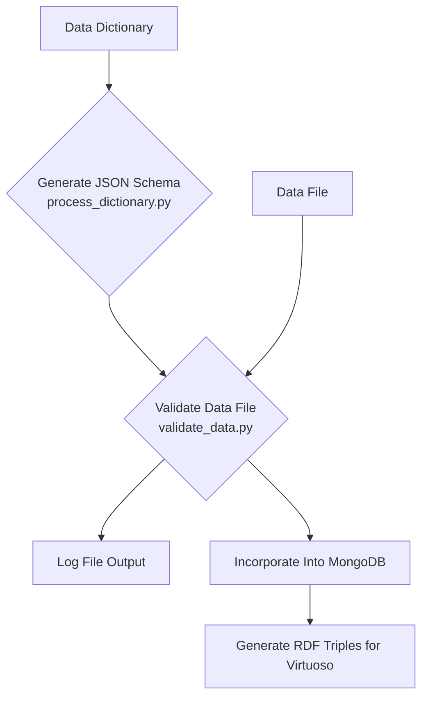

# Biomarker Partnership  

The goal of this project is to develop a community-based biomarker-centric data model to harvest and organize biomarker knowledge for diverse biological data types. 

- [Intro](#intro)
    - [Background](#background)
    - [Scope and Goal of the Project](#scope-and-goal-of-the-project)
    - [Initial Biomarker Database Curation](#initial-biomarker-database-curation)
- [Biomarker Defition](#biomarker-definition)
- [Project Workflow](#workflow)
- [Usage Guides](./supplementary_files/documentation/README.md)
- [Top Level Repository Structure](#top-level-repository-structure)
- [References](#references)

## Intro
### Background 
The FDA-NIH Biomarker Working Group (FNBWG) BEST resource1 defines a biomarker as a "characteristic that is measured as an indicator of normal biological processes, pathogenic processes, or responses to an exposure or intervention, including therapeutic interventions". Biomarkers, measured in body fluids or tissues, are useful instrements for clinical inquiry and a growing focus of research. Biomarkers comprise important tools in the transition toward Predictive, Preventive, Personalized, Participatory medicine2 and serve as valuable indicators in drug development, as well as surrogate endpoints in clinical trials.

### Scope and Goal of the Project
Biomarker research has led to distributed sets of data and the overall collection of relevant biomarker data in many different resources. The goal of this project is to provide systematic harmonization and organization of biomarker data by mapping biomarker data from public sources to Common Fund data elements. Importantly, biomarker discovery <ins>is not</ins> the goal of this project. 

### Initial Biomarker Database Curation
This project focuses on creating a biomarker database from different, relevant resources. So far we have extracted biomarkers from 5 different resources: OpenTargets, ClinVar, GWAS Catalog, MarkerDB (automated curation), and OncoMX (manual curation). The information and data extracted from the resources was done based on an agreed upon defintion of biomarkers and what the core elements were for a biomarker (indicated in Figure 1).

## Biomarker Definition

  
*Fig 1. Biomarker Data Model. Data types and relations (named boxes and arrows, respectively) in the biomarkers of clinical interest space; “core” biomarker data types (green boxes), additional data types (blue boxes) provide valuable contextual knowledge. References and additional annotations can be added to a database implementation of the model.*

The elements highlighted in green are data types that would need to be extracted from the resources in order for a basic biomarker definition to be formed (assessed_biomarker_entity, condition_name, biomarker_status, evidence_source/type). Other data types such as loinc_code, specimen_type, and best_biomarker_type were not deemed as core elements but still provide context to the defintion of a particular biomarker (clinical lab measurements, where to measure the biomarker from, and what type of biomarker it is). These data types were mapped to the biomarker from outside resources such as LOINC and Uberon Ontology.

There is also a notes section present in this databse and that includes extra/miscellaneous deatils of the biomarker. This can include the exact mutation/amino acid change/expression data, Uniprot identifier, panel information, and the genome build. This data could be mapped from an outside resource or could be extracted directly from the reource the biomarker is being extracted from.

Based on the resource that was being studied there can be some variation in how the data was extracted, manipulted, and harmonized to fit the structre of the above figure. This repository will provide examples of this alonsgide the table generated and other resources needed to gain information/data for the biomarker.

A sample single entry JSON structure for the data model can be found [here](./supplementary_files/sample_data_model_structures/). The data model RFC can be found [here](./supplementary_files/documents/Master_Biomarker_Partnership_Data_Model_RFC.pdf).

## Workflow

The general workflow is as described in the flowchart below. It starts with the most current data dictionary. The data dictionary can then be converted into a JSON schema format. Once the current version's schema has been generated, you can validate your data files against the schema to ensure they conform to the latest data dictionary. The detailed usage guides and documentation can be found [here](https://github.com/biomarker-ontology/biomarker-partnership/tree/main/supplementary_files/documentation).

## Top Level Repository Structure 

| Directory             | Description                                                                           |
|-----------------------|---------------------------------------------------------------------------------------|
| `data`                | Contains the raw data and resulting data before and after processing. |
| `data_dictionary`     | Contains the information for the agreed upon data dictionary.             |
| `mapping_data`        | Contains some supporting data that can be used to map contextual data to the biomarkers.   |
| `schema`              | Contains the validation JSON schemas derived from the data dictonary.                 |
| `src`                 | Contains code for data wrangling, conversion, and extraction.                                                         |
| `supplementary_files` | Testing, example, and documentation files for the project.                                              | 

The `.gitignore` file includes entries for directories named `home/` and `env/`. The `home/` directory can be used for any source files, temporary files, log files, files larger than Github's limit of 100 MiB, or any other files that don't need to be pushed to the upstream repository. The `env/` directory should be the name of your virtual environment. If using a different virtual environment name, update the `.gitignore`.  

## References

- **1**: FDA-NIH_Biomarker_Working_Group. in BEST (Biomarkers, EndpointS, and other Tools) Resource [https://www.ncbi.nlm.nih.gov/books/NBK326791].     (2016). 
- **2**: Hood, L., Balling, R. & Auffray, C. Revolutionizing medicine in the 21st century through systems approaches. Biotechnol J 7, 992-1001 (2012). https://doi.org:10.1002/biot.201100306 