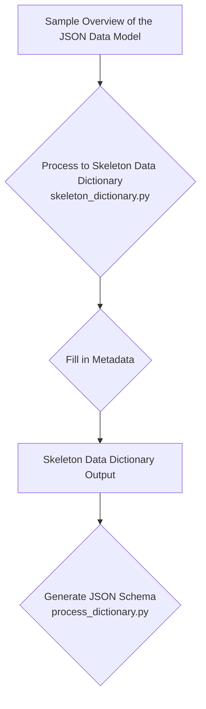

# Data Dictionary

The data dictionary is used to aid in the integration of biomarker partnership data from many disparate sources. The data dictionary sets the format and standard for all data incororated into the project.

- [Workflow](#workflow)
- [Generating a Skeleton Data Dictionary](#generating-a-skeleton-data-dictionary)
- [Data Dictionary Structure](#data-dictionary-structure)
    - [Basic Top Level Element](#basic-top-level-element)
    - [Nested Elements](#nested-elements)
    - [Conditional and Mutually Exclusive Fields](#conditional-and-mutually-exclusive-fields)
- [Generating a Schema](#generating-a-schema)

## Workflow 

The general workflow for generating a full JSON schema from the data dictionary has been abstracted into multiple steps for simplicity's sake. These steps are optional if you would rather directly edit the JSON schema, but they are useful for abstracting away some of the complexities of generating and maintaining a complex JSON schema. 



## Generating a Skeleton Data Dictionary 

Using a [sample data model JSON file](../supplementary_files/sample_data_model_structures/), a skeleton data dictionary can be generated using the `skeleton_dictionary.py` script. 

If applicable, in the project root directory, update the `conf.json` file with the updated version number. 

Make sure the corresponding output directory exists prior to running `skeleton_dictionary.py`. 

While inside the project root directory:

```
mkdir data_dictionary/<VERSION> 
```

The `skeleton_dictionary.py` script can take these arguments:

```
Positional arguments:
    file_path           filepath of the sample data model JSON

Optional arguments:
    -h --help           show the help message and exit
    -v --version        show the current version number and exit
```

Move your current working directory to `data_dictionary/` adn run the `skeleton_dictionary.py` script passing in the filepath to the sample data model JSON file. 

```
cd data_dictionary
python skeleton_dictionary.py <FILEPATH/TO/SAMPLE>
```

This will create the general data dictionary structure, now you will have to fill in each field's metadata. 

Note: The `skeleton_dictionary.py` file utilizes union type hinting. This is a feature introduced in Python 3.10. The script also requires a feature introduced in Python 3.7, when the regular `dict` type became order preserving. If using a version of Python older than this, `dict` keys were not guaranteed to be ordered and could result in undefined behaviour on a per execution basis when reading the JSON keys and dumping the output JSON.

## Data Dictionary Structure 

The data dictionary represents a simplified structure of the eventual JSON schema. The `process_dictionary.py` script is agnostic to the actual fields and nested structure of the data dictionary. 

#### Basic Top Level Element

The structure of a basic top level element in the data dictionary looks like this:

```json
"biomarker_id": {
    "description": "Biomarker identifier. This will be automatically assigned when the data is incorporated.",
    "type": "string",
    "required": {
        "requirement": false
    }, 
    "example": ["A0034"],
    "pattern": "^.*$",
    "pattern_notes": "Matches on an entire line, regardless of content, including an empty line."
}
```

**Elements:**
- *Field name* - The name of the field (Ex. `"biomarker_id"`).
    - *Description* - A description of the field. 
    - *Type* - Type for the field. 
    - *Required* - Metadata for the field requirement conditions.
        - *Requirement* - Whether the field is required or not. This value can accept `true`, `false`, or `conditional`. 
        - *Conditionals* - If `requirement` is set to `conditional`, then conditional requirements can be added. If a field's requirement is conditional on another field (or fields) being present, you can add those field names here. 
        - *Exclusions* - If `requirement` is set to `conditional`, then exclusion requirements can be added. If a field's presence is mutually exclusive based on another field (or fields) being present, you can add those field names here. 
    - *Example* - An example for the field (supports multiple examples).
    - *Pattern* - A regex pattern to validate the data against.
    - *Pattern notes* - This field is optional (and is not used by the `process_dictionary.py` script), a description of the regex pattern purely for readability/clarities sake. 

#### Nested Elements 

The data dictionary also supports nested elements.

The structure of a nested element in as an array looks like this:

```json
"biomarker_component": {
    "description": "List of biomarker components.",
    "type": "array",
    "required": {
        "requirement": true
    },
    "items": { 
        "biomarker": {
            "description": "Change observed in an entity that differs from normal processes.",
            "type": "string",
            "required":{
                "requirement": true
            },
            "example": ["presence of rs1800562 mutation"],
            "pattern": "^.+$",
            "pattern_notes": "Matches on an entire line, regardless of content, not including an empty line."
        },
        "assessed_biomarker_entity": {
            "description": "Biomarker entity and common name/gene symbol/short name.",
            "type": "string",
            "required": {
                "requirement": true
            },
            "example": ["rs1800562 mutation in hereditary haemochromatosis protein (hereditary hemochromatosis protein) (HFE)"],
            "pattern": "^.+$",
            "pattern_notes": "Matches on an entire line, regardless of content, not including an empty line."
        },
        // ...more elements here
    }
}
```

**Elements:**  
The basic structure is essentially the same as the single top level element with the only difference being the parent element metadata. The parent element still requires the `description`, `type`, and `required` fields. The parent element also requires the `items` keyword that contains the nested elements. The `items` value must be an object, even if the parent `type` is an array. This is done for simplicity and readability's sake, especially when viewing and exploring the data dictionary in a [JSON viewer](https://jsonviewer.stack.hu/).

For children elements, the overall requirement is inherited from their ancestor elements. In this example, the `biomarker` field marked as required but the requirement of the field is inherently conditional on the presence of the `biomarker_component` parent element. If, for example, the `biomarker_component` was not required, then the requirement of its nested elements would be required if the `biomarker_component` was present, and not if the `biomarker_componenet` parent element was not included in the data. 

#### Conditional and Mutually Exclusive Fields

Fields can be set as conditionally dependent on the presence of other fields on the same level in the hierarchy. Fields can also be set as mutually exclusive on the presence of other fields on the same level. This is done by setting the value of the `requirement` field to `'conditional'` and adding the `conditionals` and `exclusions` fields, both which take an array of strings as shown below.

```json
"condition": {
    "description": "Component for the condition data.",
    "type": "object",
    "required": {
        "requirement": "conditional",
        "conditionals": [],
        "exclusions": [
            "exposure_agent"
        ]
    },
    "items": {
        // ...nested fields
    }
}
```

Here, the `condition` field is set as mutually exclusive with the `exposure_agent` field. If the `exposure_agent` field is present in the data then the `condition` field should not exist (or be non-null). 

Children elements on the same level can also be conditionally required based on other nested elements or mutually exclusive with other children elements in the same way. 

## Generating a Schema

If applicable, in the project root directory, update the `conf.json` file with the updated version number. 

Make sure the corresponding schema directory exist prior to running `process_dictionary.py`. While inside the project root directory:

```bash
mkdir schema/<VERSION>
```

The `process_dictionary.py` can take these arguments:

```
Positional arguments:
    file_path           filepath of the data dictionary JSON to convert

Optional arguments 
    -h --help           show the help message and exit
    -v --version        show current version number and exit
```

Move your current working directory to this directory and run the `process_dictonary.py` script passing in the filepath to the data dictionary JSON you want to process. 

```bash
cd data_dictionary
python process_dictionary.py <FILEPATH/TO/DICTIONARY>
```